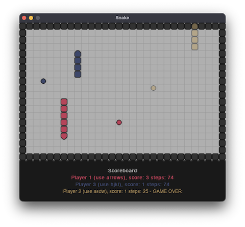

# Snake [WIP]

### Play

```bash
uv run python -m snake
```
- upto 3 players simultaneously



### GA Train

```bash
uv run --group ga train_ga.py
```
- 400 genomes
- 8x4 matrix controlled
- 8 features: danger (rel. distance to wall or body) in each direction, rel. distance to apple in each direction
- problem of GA in general:

  1. **Large number of possible combinations:**

    If we consider only binary values (-1, 1) for 8x4 feature array, there is 2^32=4,294,967,296 possible combinations. (And the input can be non-binary, so even larger.)

    Feature arrays are adjusted only via mutations or crossovers. Most of the adjuted arrays are not correctly connecting the features with the direction controls, because of the large number of possible combinations and random nature (mentioned in 2).

  2. **Feature focus:**

    Because deterministic apple (predefined positions for training) is being used, genome is learning single feature at a time. (When random apple was used, selection tended to prefer genomes, that had the apple right in front of them randomly by accident, not by learning any feature.)

    Adjusted features are selected randomly. There is no mechanism of keeping good features, that might be very useful later.

https://github.com/user-attachments/assets/9097a2af-d041-4078-a492-54cf8ffe0297
